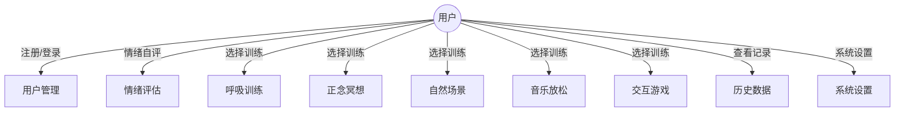
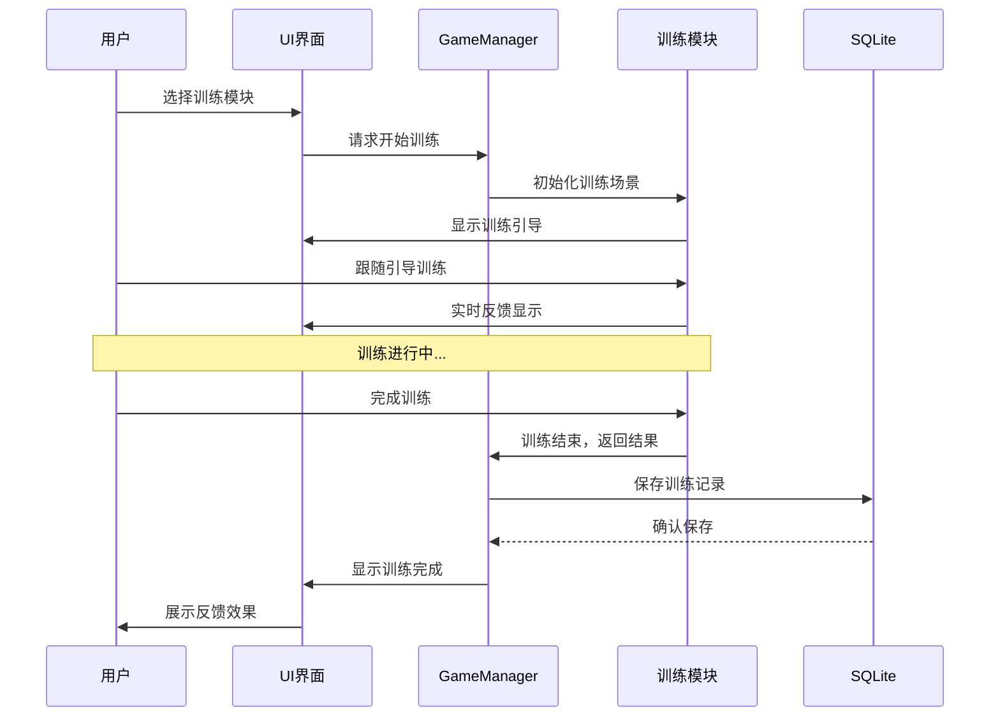

# UML 图设计

## 用例图



## 类图（核心类）

```
┌─────────────────────┐
│    GameManager      │
├─────────────────────┤
│ - instance: static  │
│ - userData: UserData│
│ - currentState     │
├─────────────────────┤
│ + Awake()          │
│ + Start()          │
│ + LoadScene()      │
│ + SaveData()       │
│ + LoadData()       │
└─────────┬───────────┘
          │
┌─────────┴──────────────┐
│     UserData           │
├────────────────────────┤
│ - userId: int         │
│ - userName: string    │
│ - records: List<Record>│
├────────────────────────┤
│ + AddRecord()         │
│ + GetHistory()        │
│ + GetStatistics()     │
└────────────────────────┘

┌──────────────────────┐     ┌──────────────────────┐
│   EmotionAssessment  │     │   EmotionRecord      │
├──────────────────────┤     ├──────────────────────┤
│ - preScore: int     │     │ - recordId: int      │
│ - postScore: int    │     │ - dateTime: DateTime │
│ - anxietyLevel: int │     │ - preScore: int      │
├──────────────────────┤     │ - postScore: int     │
│ + StartAssessment() │     │ - trainingType: enum │
│ + SubmitScore()     │     │ - duration: float    │
│ + ShowResult()      │     ├──────────────────────┤
└──────────────────────┘     │ + ToJSON()           │
                             │ + FromJSON()         │
                             └──────────────────────┘

┌──────────────────────┐
│   BreathingGuide     │
├──────────────────────┤
│ - phase: enum        │
│ - duration: float    │
│ - isActive: bool     │
├──────────────────────┤
│ + StartBreathing()   │
│ + UpdatePhase()      │
│ + StopBreathing()    │
│ + OnPhaseChanged()   │
└──────────────────────┘
```

## 时序图（训练流程示例）


