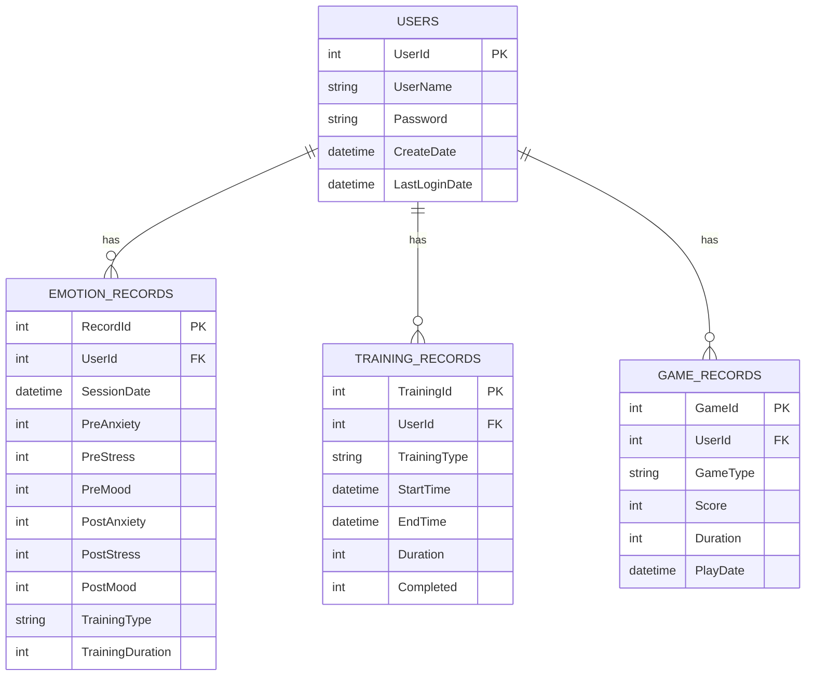

# 数据库设计

## 技术选型
- **数据库类型**：SQLite（轻量级，适合本地单机应用）
- **数据存储路径**：Application.persistentDataPath
- **ORM方案**：直接使用 ADO.NET / C# SQLite 接口

## 数据库表结构

### 1. 用户表（Users）
| 字段名 | 类型 | 说明 |
|--------|------|------|
| UserId | INTEGER PRIMARY KEY | 用户ID，自增 |
| UserName | TEXT NOT NULL | 用户名 |
| Password | TEXT | 密码（可选） |
| CreateDate | DATETIME | 注册时间 |
| LastLoginDate | DATETIME | 最后登录时间 |

### 2. 情绪评估记录表（EmotionRecords）
| 字段名 | 类型 | 说明 |
|--------|------|------|
| RecordId | INTEGER PRIMARY KEY | 记录ID，自增 |
| UserId | INTEGER | 用户ID（外键） |
| SessionDate | DATETIME | 训练日期 |
| PreAnxiety | INTEGER | 训练前焦虑评分（1-10） |
| PreStress | INTEGER | 训练前压力评分（1-10） |
| PreMood | INTEGER | 训练前情绪评分（1-10） |
| PostAnxiety | INTEGER | 训练后焦虑评分（1-10） |
| PostStress | INTEGER | 训练后压力评分（1-10） |
| PostMood | INTEGER | 训练后情绪评分（1-10） |
| TrainingType | TEXT | 训练类型 |
| TrainingDuration | INTEGER | 训练时长（秒） |

### 3. 训练记录表（TrainingRecords）
| 字段名 | 类型 | 说明 |
|--------|------|------|
| TrainingId | INTEGER PRIMARY KEY | 训练ID，自增 |
| UserId | INTEGER | 用户ID（外键） |
| TrainingType | TEXT | 训练类型 |
| StartTime | DATETIME | 开始时间 |
| EndTime | DATETIME | 结束时间 |
| Duration | INTEGER | 持续时长（秒） |
| Completed | INTEGER | 是否完成（0/1） |

### 4. 游戏记录表（GameRecords）
| 字段名 | 类型 | 说明 |
|--------|------|------|
| GameId | INTEGER PRIMARY KEY | 游戏记录ID |
| UserId | INTEGER | 用户ID（外键） |
| GameType | TEXT | 游戏类型 |
| Score | INTEGER | 得分 |
| Duration | INTEGER | 游戏时长 |
| PlayDate | DATETIME | 游玩时间 |

## ER图

