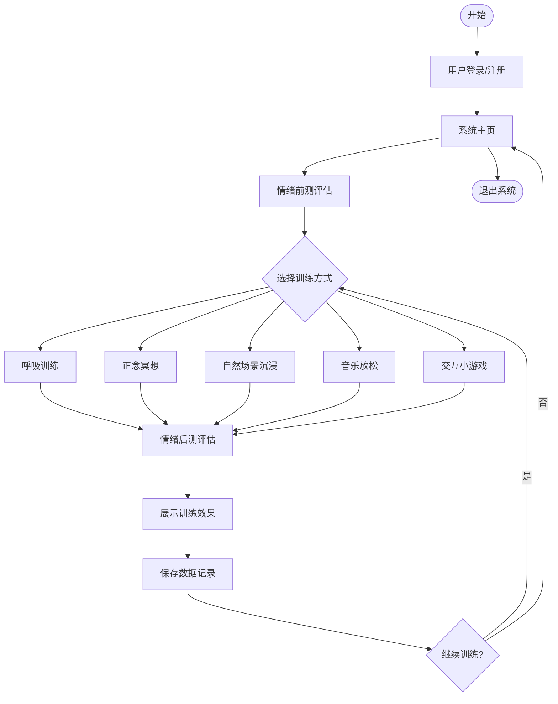
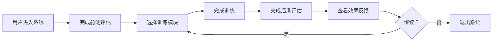
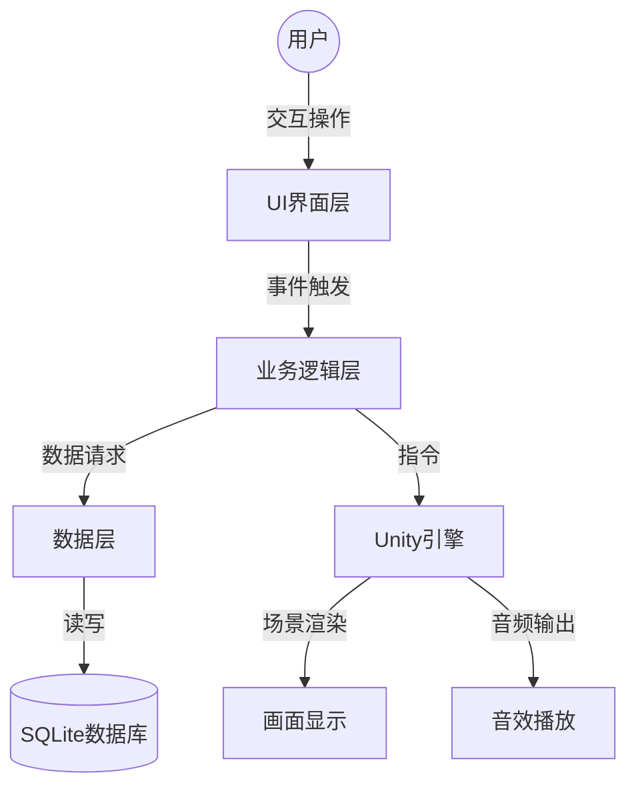

# 系统流程图

## 整体流程

```mermaid
flowchart TD
    Start([开始]) --> Login[用户登录/注册]
    Login --> Home[系统主页]
    Home --> PreTest[情绪前测评估]
    PreTest --> Choose{选择训练方式}
    
    Choose --> Breath[呼吸训练]
    Choose --> Meditation[正念冥想]
    Choose --> Nature[自然场景沉浸]
    Choose --> Music[音乐放松]
    Choose --> Game[交互小游戏]
    
    Breath --> PostTest[情绪后测评估]
    Meditation --> PostTest
    Nature --> PostTest
    Music --> PostTest
    Game --> PostTest
    
    PostTest --> ShowResult[展示训练效果]
    ShowResult --> Record[保存数据记录]
    Record --> Decide{继续训练?}
    Decide -->|是| Choose
    Decide -->|否| Home
    
    Home --> Logout([退出系统])
```

## 用户使用流程

```mermaid
flowchart LR
    A[用户进入系统] --> B[完成前测评估]
    B --> C[选择训练模块]
    C --> D[完成训练]
    D --> E[完成后测评估]
    E --> F[查看效果反馈]
    F --> G{继续？}
    G -->|是| C
    G -->|否| H[退出系统]
```

## 数据流流程

```mermaid
flowchart TD
    User((用户)) -->|交互操作| UI[UI界面层]
    UI -->|事件触发| Logic[业务逻辑层]
    Logic -->|数据请求| Data[数据层]
    Data -->|读写| DB[(SQLite数据库)]
    Logic -->|指令| Unity[Unity引擎]
    Unity -->|场景渲染| Display[画面显示]
    Unity -->|音频输出| Audio[音效播放]
```
